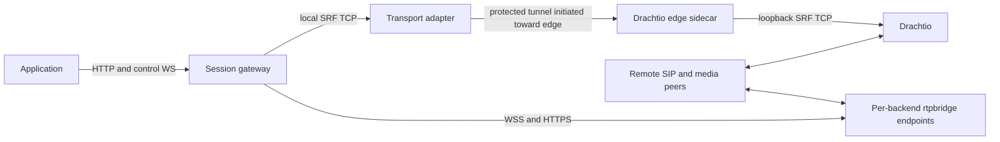

# Cross-Cluster Deployment

The gateway can run on a private application network while Drachtio and rtpbridge run on a separate edge network. Discovery, transport, SIP route decisions, and media reachability are separate requirements. DNS records identify destinations; they do not establish network access or translate protocols.

This page describes current interfaces and a proposed integration boundary. The repository does not currently ship a cross-cluster tunnel, endpoint-registry client, DNS publisher, or Kubernetes operator.

The [implementation plan](../development/cross-cluster-plan.md) specifies the recommended contracts, failure behavior, delivery sequence, and acceptance tests. It keeps platform-specific discovery and tunnel protocols outside the public gateway.

## Required Paths

| Path | Current gateway interface | Infrastructure responsibility |
| --- | --- | --- |
| Application to gateway | HTTP and control WebSocket | Private ingress, owner affinity, preserving established connections during drain. |
| Gateway to Drachtio | One raw SRF TCP connection via `DRACHTIO_HOST` and `DRACHTIO_PORT` | Reachable private endpoint or a local TCP compatibility adapter backed by a protected tunnel. |
| Drachtio INVITE route lookup | `/drachtio/route` HTTP callback returning an application tag or rejection | Direct private callback access, or reverse lookup relay over a connection initiated from the application network. |
| Gateway to rtpbridge | WSS JSON-RPC and HTTPS recording requests | A stable, individually addressable control endpoint for each backend; TLS identity and HMAC key distribution. |
| Remote peers to edge media | RTP/SRTP, ICE/DTLS-SRTP, and TURN | Public media addresses, UDP paths, NAT/firewall policy, and coturn deployment. |
| rtpbridge to playback source | Backend-initiated HTTP download | An edge-reachable audio origin admitted by rtpbridge's download policy. An application-network URL will not work when edge-initiated traffic is prohibited. |

The gateway does not carry RTP between the application and edge networks. Playback bytes are fetched by rtpbridge, and recordings are downloaded by the gateway from the selected backend. Object storage or a restricted audio-origin proxy can serve playback when the edge cannot contact private application services.

## External Adapter Boundary

An existing control-plane service can own endpoint discovery, publish local discovery records, deploy narrowly scoped proxies, and translate its private tunnel protocol. The public gateway can continue consuming SRF TCP and rtpbridge's public control/recording protocols.

For a network that permits connections only from the application network toward edge:



The adapter must preserve one gateway SRF connection to one Drachtio process, bound queues, authenticate the edge endpoint, and retain that connection through gateway drain. A raw TCP proxy cannot communicate with an application-framed WSS tunnel without a protocol adapter. Drachtio's admin socket need not become a cross-network service.

INVITE route lookup also needs an explicit owner. The recommended topology uses dedicated Drachtio for this gateway: its trusted adapter relays reverse lookups to the gateway and returns the result over the existing tunnel. It does not depend on another product's SIP router. If Drachtio is shared, an existing trusted router can dispatch by SIP Request-URI host and then select the gateway's registered tag. Exact gateway hosts must precede broader product wildcards, and every eligible router must apply that policy. Independently round-robining a gateway-only router and a general SIP router can send calls to the wrong owner.

A returned application tag must be registered on the exact Drachtio instance that originated the lookup. The gateway currently connects to one Drachtio endpoint, so deploy an instance/adapter pair per desired Drachtio relationship, or add a general multiple-Drachtio transport interface later. Each overlapping deployment instance needs a distinct tag. Its route owner must stop choosing the old tag when `/readyz` fails or `gateway.draining` arrives, while preserving its SRF stream for existing dialogs.

## Endpoint Catalog

Set `RTPBRIDGE_ENDPOINTS_FILE` to a file your platform atomically replaces. The
catalog is authoritative when configured: empty, unavailable or expired capacity
never falls back to DNS. Use a stable backend ID for each media/storage identity.
Control and recording URLs can have separate ports and TLS names.

```json
{
  "schemaVersion": 1,
  "revision": "publisher-42",
  "validUntil": "2026-09-26T18:00:30.000Z",
  "backends": [
    {
      "id": "media-0",
      "acceptNew": true,
      "control": {"url": "wss://10.20.0.40:9100/", "tlsServerName": "media-control.example.internal"},
      "recordings": {"url": "https://10.20.0.40:9200/", "tlsServerName": "media-recordings.example.internal"},
      "turn": {"urls": ["turns:turn-0.example.com:443?transport=tcp"]}
    }
  ]
}
```

`schemaVersion`, `revision`, `backends`, `id`, `acceptNew` and `control` are
required. `validUntil`, `recordings` and `turn` are optional. Without `recordings`,
the gateway derives HTTP(S) from the control URL and uses its TLS name. URLs must
be roots without credentials, paths, queries or fragments. WSS/HTTPS are required;
`RTPBRIDGE_ENDPOINTS_ALLOW_PLAINTEXT=true` is an explicit development override.
The file is limited to 256 KiB and 128 unique backends. A malformed or missing
replacement retains the last accepted view and its original expiry.

```bash
RTPBRIDGE_ENDPOINTS_FILE=/run/discovery/media.json
RTPBRIDGE_REQUIRED=true
RTPBRIDGE_AUTH_HMAC_SECRET_FILE=/run/secrets/rtpbridge-hmac
RTPBRIDGE_TLS_CA_FILE=/run/secrets/edge-server-ca.pem
SIP_ALLOWED_DOMAINS_JSON='["gateway.sip.example.com"]'
ROUTES_REQUIRED=true
```

Set `acceptNew=false` to withdraw capacity while retaining recording access.
Existing media clients stay connected. A fresh session for a pinned call fails
if its backend is missing or non-admitting; it never moves to another backend.
An expired catalog blocks fresh sessions while retaining known recording
identities. Keep an expired/removed backend address reachable for any operations
you still need; the gateway does not recreate its storage or network path.

When the file is unset, the existing `RTPBRIDGE_HOST` DNS mode remains available.
It uses SRV target names, the configured `RTPBRIDGE_PORT`, a shared TLS name and
round-robin selection. It ignores SRV port/priority/weight. Missing explicit or
pinned IDs fail in this mode too.

## Routing and Replacement Readiness

`SIP_ALLOWED_DOMAINS_JSON` optionally limits new inbound INVITEs and lookups to
exact Request-URI hosts, before matching users. It leaves existing dialogs alone.
An unset list preserves existing standalone behavior.

Bearer-protected `POST /routing/lookup` accepts `destinationUri` and optional
`destinationUser`. It returns `matched`, `acceptNew`, and a `tag` only when ready.
It never invokes the application or the fallback router. The JSON body is bounded
to 16 KiB, the URI to 2048 characters and the user to 256 characters.
`GET /routing/status` returns admission, drain state, process tag, registered route
count and media catalog status (revision, expiry, eligible count and reload error).
Configure `CONTROL_AUTH_MODE=bearer` for an adapter integration.

`RTPBRIDGE_REQUIRED=true` gates admission on media capacity;
`ROUTES_REQUIRED=true` also gates it on at least one local registered/static route.
Both default to false. Controller registration remains available while unready,
so deploy a separate instance-discovery/bootstrap path that reaches replacement
processes before the normal ready-only Service includes them. A protected adapter
should make deployment readiness wait for acknowledgement that the edge has
accepted the new process tag. Application owners must register routes and retain
commands on each call's original process through drain.

## Explicit TURN URLs

Set `COTURN_URLS_JSON` for deployment-wide ICE URLs or `turn.urls` for a backend
override. The existing shared `COTURN_AUTH_SECRET` and expiring REST credentials
apply to TURN URLs; STUN URLs need no secret. URLs may use `stun:`, `turn:` or
`turns:` and must name reachable endpoints with valid certificates where TLS is
used. The gateway does not invent a TLS hostname. Without explicit URLs, a
configured secret retains cohosted STUN and UDP/TCP TURN using the advertised IPv4
media address; this fallback does not advertise TLS TURN.

The gateway owns protocol behavior, admission, affinity and draining. The platform
owns certificates, firewall rules, routable endpoints, DNS, proxy deployment and
translation of its private discovery contracts.

## Integration Acceptance

Validate the actual protected network before describing it as supported:

- Correct instance selection for both SRF and recordings, including multiple backends and ports.
- Wrong certificate identity, wrong HMAC, and unauthorized workload rejection.
- Reverse INVITE routing with no edge-initiated application-network connection and no raw Drachtio admin exposure.
- Live media and signaling throughout gateway drain; route selection stops admitting the old instance before its connection closes.
- Backend admission removal preserves active connections and access to stored recordings.
- Playback origins and TURN/media addresses remain reachable from their actual callers.

The local Compose suite verifies gateway drain, catalog admission, multiple backend
ports and authenticated media/recording behavior. It does not reproduce an external platform's endpoint registry, protected tunnel, routing policy, or cluster network.
