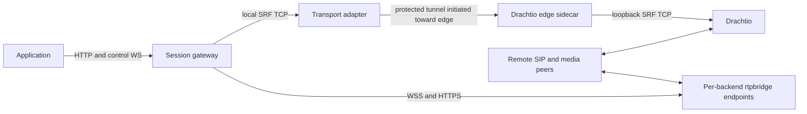

# Cross-Cluster Deployment

The gateway can run on a private application network while Drachtio and rtpbridge run on a separate edge network. Discovery, transport, SIP route decisions, and media reachability are separate requirements. DNS records identify destinations; they do not establish network access or translate protocols.

This page describes current interfaces and a proposed integration boundary. The repository does not currently ship a cross-cluster tunnel, endpoint-registry client, DNS publisher, or Kubernetes operator.

The [implementation plan](../development/cross-cluster-plan.md) specifies the recommended contracts, failure behavior, delivery sequence, and acceptance tests. It keeps platform-specific discovery and tunnel protocols outside the public gateway.

## Required Paths

| Path | Current gateway interface | Infrastructure responsibility |
| --- | --- | --- |
| Application to gateway | HTTP and control WebSocket | Private ingress, owner affinity, preserving established connections during drain. |
| Gateway to Drachtio | One raw SRF TCP connection via `DRACHTIO_HOST` and `DRACHTIO_PORT` | Reachable private endpoint or a local TCP compatibility adapter backed by a protected tunnel. |
| Drachtio INVITE route lookup | `/drachtio/route` HTTP callback returning an application tag or rejection | Direct private callback access, or reverse lookup relay over a connection initiated from the application network. |
| Gateway to rtpbridge | WSS JSON-RPC and HTTPS recording requests | A stable, individually addressable control endpoint for each backend; TLS identity and HMAC key distribution. |
| Remote peers to edge media | RTP/SRTP, ICE/DTLS-SRTP, and TURN | Public media addresses, UDP paths, NAT/firewall policy, and coturn deployment. |
| rtpbridge to playback source | Backend-initiated HTTP download | An edge-reachable audio origin admitted by rtpbridge's download policy. An application-network URL will not work when edge-initiated traffic is prohibited. |

The gateway does not carry RTP between the application and edge networks. Playback bytes are fetched by rtpbridge, and recordings are downloaded by the gateway from the selected backend. Object storage or a restricted audio-origin proxy can serve playback when the edge cannot contact private application services.

## External Adapter Boundary

An existing control-plane service can own endpoint discovery, publish local discovery records, deploy narrowly scoped proxies, and translate its private tunnel protocol. The public gateway can continue consuming SRF TCP and rtpbridge's public control/recording protocols.

For a network that permits connections only from the application network toward edge:



The adapter must preserve one gateway SRF connection to one Drachtio process, bound queues, authenticate the edge endpoint, and retain that connection through gateway drain. A raw TCP proxy cannot communicate with an application-framed WSS tunnel without a protocol adapter. Drachtio's admin socket need not become a cross-network service.

INVITE route lookup also needs an explicit owner. The recommended topology uses dedicated Drachtio for this gateway: its trusted adapter relays reverse lookups to the gateway and returns the result over the existing tunnel. It does not depend on another product's SIP router. If Drachtio is shared, an existing trusted router can dispatch by SIP Request-URI host and then select the gateway's registered tag. Exact gateway hosts must precede broader product wildcards, and every eligible router must apply that policy. Independently round-robining a gateway-only router and a general SIP router can send calls to the wrong owner.

A returned application tag must be registered on the exact Drachtio instance that originated the lookup. The gateway currently connects to one Drachtio endpoint, so deploy an instance/adapter pair per desired Drachtio relationship, or add a general multiple-Drachtio transport interface later. Each overlapping deployment instance needs a distinct tag. Its route owner must stop choosing the old tag when `/readyz` fails or `gateway.draining` arrives, while preserving its SRF stream for existing dialogs.

## rtpbridge Discovery With Current Configuration

An external controller can publish SRV records on the application network:

```text
_ws._tcp.media.example.internal -> media-0.example.internal:9100
_ws._tcp.media.example.internal -> media-1.example.internal:9100
media-0.example.internal        -> private endpoint for backend 0
media-1.example.internal        -> private endpoint for backend 1
```

The SRV target names become gateway `backendId` values. Keep each name associated with one stable backend/storage identity. Do not put a randomly balanced VIP behind each target: recording downloads and per-call media affinity need the exact backend. Backend control endpoints and public media addresses are distinct; rtpbridge advertises media addresses in SDP and `server.info`.

```bash
RTPBRIDGE_HOST=media.example.internal
RTPBRIDGE_PORT=9100
RTPBRIDGE_TLS=true
RTPBRIDGE_AUTH_HMAC_SECRET_FILE=/run/secrets/rtpbridge-hmac
RTPBRIDGE_TLS_CA_FILE=/run/secrets/edge-server-ca.pem
RTPBRIDGE_TLS_SERVERNAME=media-control.example.internal
```

All selected endpoints must use the configured port and present a certificate valid for the configured TLS name. The current resolver uses SRV target names but ignores SRV port/priority/weight; it uses `RTPBRIDGE_PORT` and round-robin selection. TLS settings and the HMAC key are shared across selected backends. Recording HTTP and control WS use the same backend authority.

DNS projection can support basic discovery. It cannot express backend admission independently of backend addressability. Removing a draining backend from SRV also removes it from recording lookup; a missing preferred backend can fall back to another backend for new allocation. Do not treat this as a complete backend rolling-upgrade mechanism.

## General-Purpose Follow-Up Interfaces

The following are proposed extensions, not implemented configuration:

- A gateway-owned endpoint catalog, supplied as an atomically replaced file or through a pluggable provider. Entries would separate stable backend ID, control URL, recording URL, TLS server name, and `acceptNew` state. A platform adapter could translate its authenticated registry into this catalog without teaching the public gateway its private registry protocol.
- Separate selection of new work from access to existing backends. Draining endpoints must remain usable for pinned calls and recording retrieval. Missing pinned targets should fail explicitly rather than silently allocate on a different backend.
- A Drachtio transport seam that accepts an injected stream, with readiness/draining lifecycle callbacks. A platform adapter could provide a protected tunnel while the default implementation remains ordinary TCP. Multiple Drachtio relationships would be a separate extension.
- Configurable TURN URLs/TLS names. The current coturn credentials assume a sidecar cohosted with the backend's advertised IPv4 media address and construct the TLS hostname under `zynoinfra.net`; that hostname policy needs configuration before deployments with another certificate/DNS convention.
- Configurable inbound SIP host admission before application user matching, so dedicated and shared Drachtio deployments preserve the gateway's SIP domain boundary.

The gateway should own protocol behavior, admission, backend affinity, and draining. The platform should own certificates, firewall rules, routable endpoints, DNS, proxy deployment, and translation of its private discovery contracts.

## Integration Acceptance

Validate the actual protected network before describing it as supported:

- Correct instance selection for both SRF and recordings, including multiple backends and ports.
- Wrong certificate identity, wrong HMAC, and unauthorized workload rejection.
- Reverse INVITE routing with no edge-initiated application-network connection and no raw Drachtio admin exposure.
- Live media and signaling throughout gateway drain; route selection stops admitting the old instance before its connection closes.
- Backend admission removal preserves active connections and access to stored recordings.
- Playback origins and TURN/media addresses remain reachable from their actual callers.

The local Compose suite verifies gateway drain and backend behavior. It does not reproduce an external platform's endpoint registry, protected tunnel, routing policy, or cluster network.
